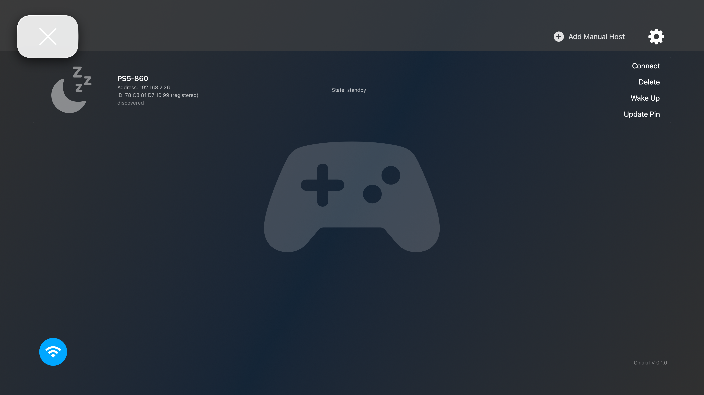
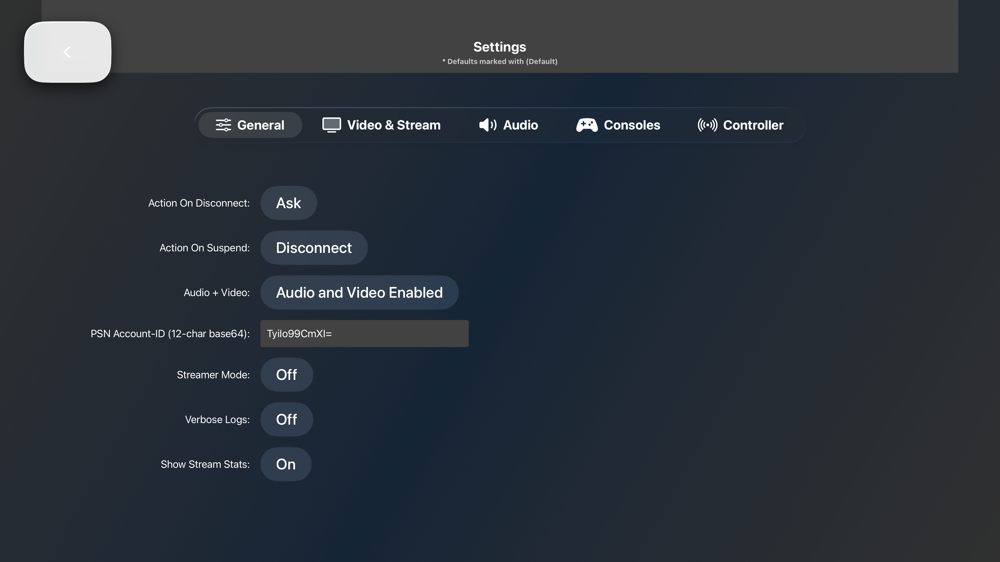
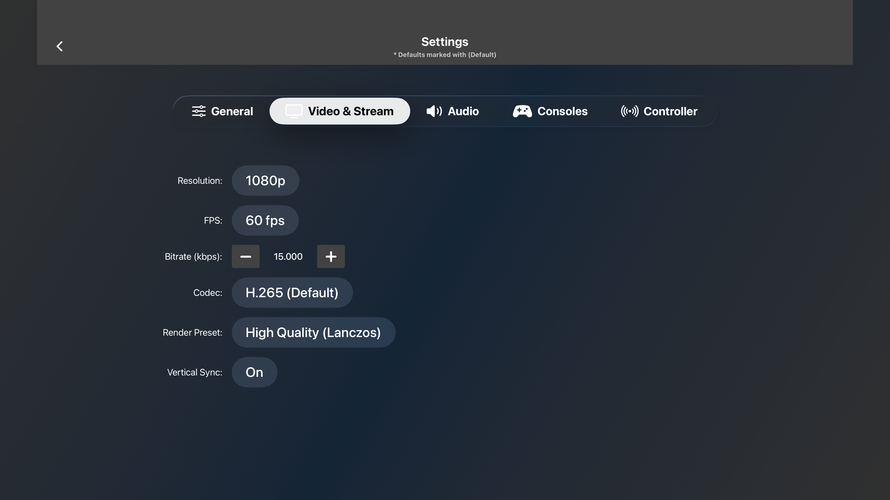
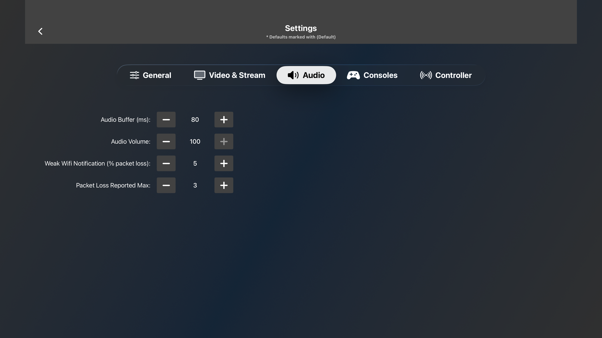
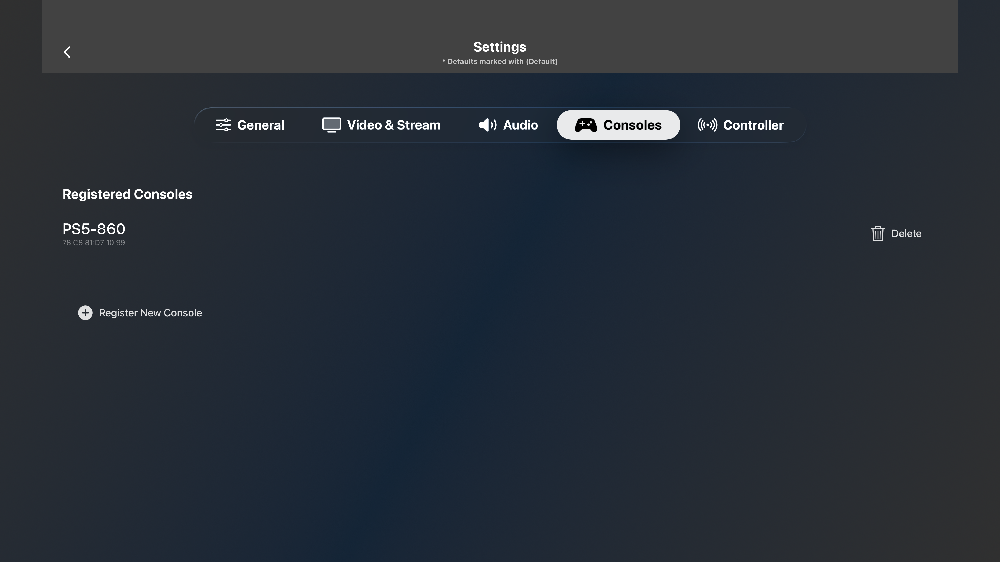
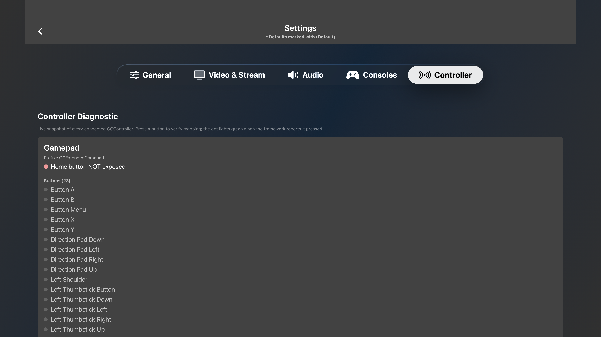
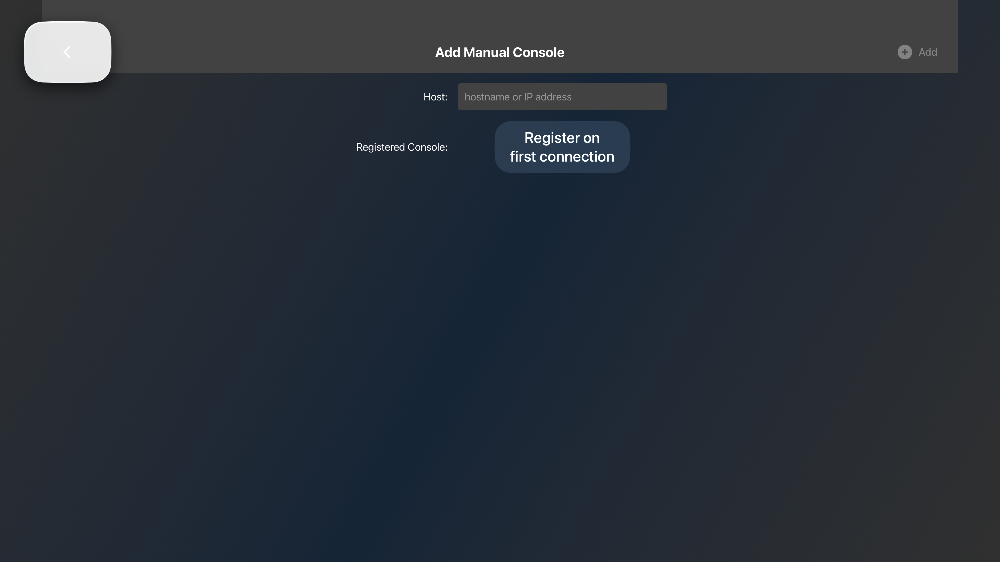
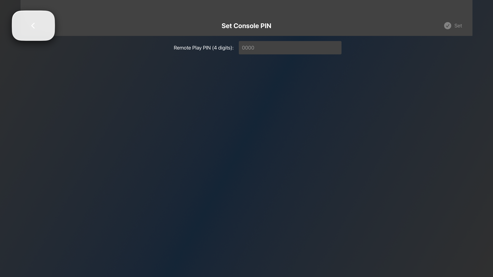
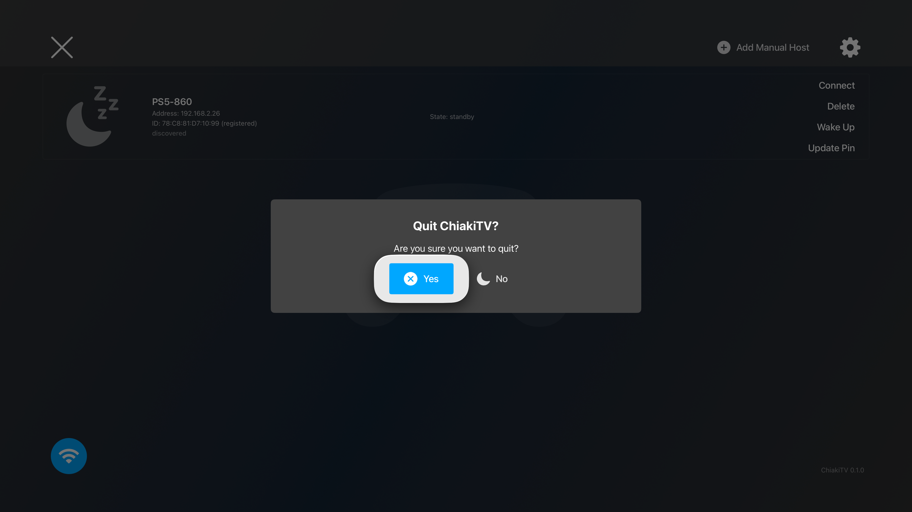
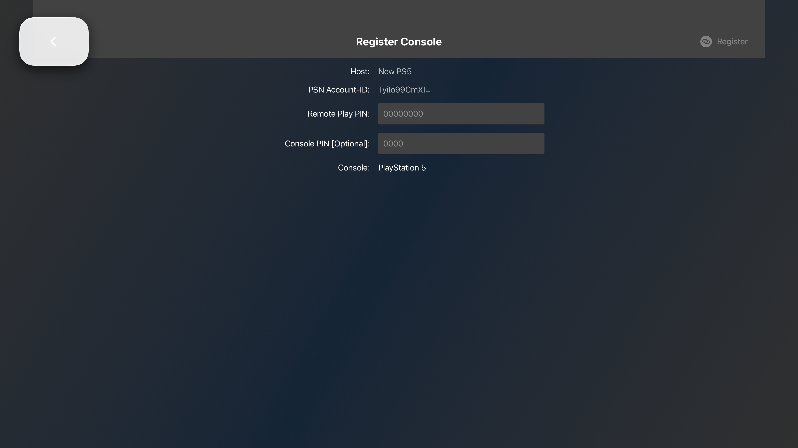

# ChiakiTV — UI/UX Redesign Plan

**Author:** UI audit + redesign synthesis, 2026-05-06.
**Scope:** every reachable, non-stream route in the tvOS app. The streaming canvas, in-stream HUD, and in-stream menu are intentionally out of scope here — they live in [`../architecture/video-pipeline.md`](../architecture/video-pipeline.md) and the recently-redesigned `StreamHUDOverlay` already establishes its own visual language.
**Audit baseline:** screenshots in [`audit-2026-05-06/`](audit-2026-05-06/) captured against `tvos-port` @ `62513031`, tvOS 26.4 simulator (Apple TV 4K, 3rd gen), with the simulator's synthetic gamepad as the input device.

---

## Part 1 — Audit findings

### 1.1 Host list (`HostListView` + `HostTile`)



**Inventory:**
- Top-left: a translucent rounded-square holding a tinted `xmark` glyph. This is the toolbar's "exit app" button. It's currently the **first focusable element** the user lands on when the app launches.
- Top bar contains, left → right: `xmark`, then a *huge* gap, then a small `Add Manual Host` pill, then a settings gear.
- One host tile, rendered as an 88-px row at 80% width. Identity column packs nickname + IP + MAC + reg state + "discovered" tag in a 4-line stack of micro-type. Status column shows a single line "State: standby" centered. Action stack right-aligned: Connect / Delete / Wake Up / Update Pin (4 buttons stacked).
- A massive translucent gamepad silhouette occupies the entire centre of the screen.
- Bottom-left: blue Wi-Fi pill — discovery-active indicator.
- Bottom-right: greyed `ChiakiTV 0.1.0` version stamp.

**Critique:**

| # | Issue | Severity |
|---|---|---|
| H1 | The decorative gamepad silhouette dominates the canvas in the populated state, but communicates nothing. It's "decorative chrome" sized like content. | High |
| H2 | The first focusable element on launch is `xmark` (exit). On a tvOS app where 99% of launches end in "press Connect on my one PS5", this is the wrong focus default. | High |
| H3 | The host tile reads as a *spreadsheet row*, not a hero. Nickname is the same weight as IP and MAC. There's no visual representation of the console (just a tiny moon glyph indicating standby). | High |
| H4 | Four stacked text-only inline action buttons on every tile. On a one-PS5 setup this is overkill — only `Connect` matters in the steady state. The other three are admin actions that should hide behind a secondary affordance. | Med |
| H5 | "(discovered)" / "(registered)" labels are inline parentheticals in 12pt grey. Critical state hidden in noise. | Med |
| H6 | "State: standby" rendered as `key: value` text rather than as state. A grey moon icon already says "asleep" — the label is redundant. | Low |
| H7 | The `xmark` "exit app" button at top-left both (a) wastes a fixed-position focus target and (b) duplicates the Siri Remote's TV button. tvOS apps **shouldn't** offer an in-app quit affordance — Apple HIG explicitly discourages it. | High |
| H8 | The gear is a single character glyph — easy to miss at 3 m. No label. | Low |
| H9 | "Add Manual Host" pill has a `+` glyph + label — fine, but the pill is small and lives ~78% across the toolbar, isolated. The visual weight doesn't telegraph "add". | Low |

### 1.2 Settings — General (`SettingsView`)



**Inventory:** centred form, label : control rows. 5 tabs (General, Video & Stream, Audio, Consoles, Controller) in a top-anchored capsule strip. Header strip uses a dark translucent material with title "Settings" + sub-caption "* Defaults marked with (Default)". Back chevron on the left.

**Critique:**

| # | Issue | Severity |
|---|---|---|
| S1 | Form is **center-aligned with a giant left margin**. On a 1920-wide tvOS screen this leaves > 800 px of dead space on each side and pushes the form into a vertical slit. Wrong layout for 16:9. | High |
| S2 | All values are pill buttons with no visual hierarchy between *cycling enums* (codec, FPS) and *open inputs* (bitrate). Form looks like a row of carbonated stickers. | Med |
| S3 | "Audio + Video: Audio and Video Enabled" — the active value reads as a sentence, but is in fact a 3-state cycler. Truncation will bite this in any other locale. | Med |
| S4 | Field labels on the left use a label-greyed style (`Action On Disconnect:`) — the trailing colon is an artefact of legacy form rendering, not a design decision. | Low |
| S5 | "PSN Account-ID (12-char base64): Tylko99CmXIs" is rendered as an editable text field next to a label, with the field itself appearing identical to a non-editable button. No affordance that this is editable. | High |
| S6 | The "* Defaults marked with (Default)" caption in the header is a workaround for missing visual states. A proper "default" state should *be* visual (e.g., a dot, a ring, a smaller subtitle), not text. | Med |
| S7 | No section grouping. "Streamer Mode" and "Verbose Logs" sit next to "Action On Disconnect" — operationally unrelated. | Med |

### 1.3 Settings — Video & Stream



**Inventory:** Resolution / FPS / Bitrate / Codec / Render Preset / Vertical Sync. Bitrate uses an explicit `[ – ]  15.000  [ + ]` stepper.

**Critique:**

| # | Issue | Severity |
|---|---|---|
| V1 | Bitrate stepper uses thousands-separator dots (`15.000`) but no unit visible inline — the unit lives in the label "(kbps)". On the right side the user sees just "15.000" which reads ambiguously (15 thousand vs. 15.0). | Med |
| V2 | "Render Preset: High Quality (Lanczos)" — an engineering term leaking into user UI. Most tvOS users won't know Lanczos from a hole in the wall. | Med |
| V3 | No preview of what each Render Preset *does*. Users can't compare. | High |
| V4 | The decision values are presented as equally-weighted, but the impact on user experience is wildly different (1080p ↔ 4K is huge; Vertical Sync on/off is invisible to most users). No visual hint at "this is the dial that actually matters." | Med |

### 1.4 Settings — Audio



**Inventory:** four numeric steppers — Audio Buffer (ms), Audio Volume, Weak Wifi Notification (% packet loss), Packet Loss Reported Max.

**Critique:**

| # | Issue | Severity |
|---|---|---|
| A1 | All four entries use the same control type (numeric stepper), same visual weight. But "Audio Volume" is high-frequency interaction, "Packet Loss Reported Max" is set-once-and-forget developer dial. | High |
| A2 | "Weak Wifi Notification (% packet loss)" and "Packet Loss Reported Max" are network/diagnostic dials, not audio dials. They're on the Audio tab because there was no better home. | Med |
| A3 | No volume slider — for a setting that's commonly tuned ±10% in normal use, a stepper at 10pt-per-tap is far slower than a continuous slider. | High |
| A4 | No mute affordance. | Low |

### 1.5 Settings — Consoles



**Inventory:** "Registered Consoles" header + a list of registered hosts with a `Delete` action per row, then a `+ Register New Console` button.

**Critique:**

| # | Issue | Severity |
|---|---|---|
| C1 | This duplicates 80% of the Host List's information for the same hosts. A user has *one* place to register and *another* place to discover — the model would be cleaner with a single "Consoles" hub. | High |
| C2 | "Register New Console" is a bottom-of-list pseudo-row with a low-contrast pill. On an empty list (post-bug-fix) it's the only thing on the page and it's not visually obvious. | Med |
| C3 | Per-row `Delete` is a small icon+label at the right edge — same visual weight as a header. Destructive action shouldn't blend into the row. | Med |

### 1.6 Settings — Controller (diagnostic)



**Inventory:** "Controller Diagnostic" header + caption explaining live snapshot. One panel per connected controller: profile name, Home-button-exposed indicator, then `Buttons (23)` and a long alphabetical list of every input with a state dot.

**Critique:**

| # | Issue | Severity |
|---|---|---|
| Co1 | The list is **alphabetical** (`Button A, B, Menu, X, Y, Direction Pad Down, Direction Pad Left…`), which scatters logically-grouped inputs across the page. The thumb cluster (A/B/X/Y) is split from the d-pad cluster which is split from the shoulder cluster. | High |
| Co2 | Long flat list scrolls off-screen. There's no visual map of the controller — just text rows. For a *diagnostic* tool, a controller silhouette with each input lighting up as pressed would be vastly more useful. | High |
| Co3 | "Home button NOT exposed" is a single red bullet under the profile. It's the most operationally important fact on the page (it tells the user the PS button won't reach the PS5 via this controller) but visually equal to any of the 23 button rows. | High |
| Co4 | This page is a developer-debug tool surfaced as an end-user setting. Either make it useful as a diagnostic *for users* (show them which physical button does what), or move it to a hidden "Diagnostics" sub-menu. | High |

### 1.7 Dialogs (Add Manual Host, Update Pin, Delete confirm, Quit confirm, Registration)







**Critique:**

| # | Issue | Severity |
|---|---|---|
| D1 | Dialogs are a mix of *full-screen views with a top toolbar* (Add Manual, Set PIN, Register) and *modal cards* (Hide, Quit). Same conceptual weight, two different presentations. | High |
| D2 | Full-screen dialog forms are centred-narrow with a back chevron + title in a translucent strip. The form column is < 30% of screen width. The rest is empty. | High |
| D3 | The Hide/Quit modal cards use `Yes / No` button labels with PS-shape glyphs (✕, ☾) — but the glyphs don't correspond to actions, they're just decorative. PS users expect ✕ = confirm, ◯ = cancel, △ = options, □ = info. The current usage muddles that. | High |
| D4 | The Register Console view exposes "PSN Account-ID" as an editable text field. This value is set in Settings → General; there is no reason to surface it in registration. Risk of user error (typing a wrong account ID at registration time invalidates the saved PSN value). | High |
| D5 | "Remote Play PIN" placeholder is `00000000` (8 chars) but Sony PS5 emits 8-digit PINs. "Console PIN (Optional)" is `0000` (4 chars) — the legacy 4-digit factory PIN. Without explanatory text, the user can't tell which is which. | High |
| D6 | Both PIN fields are vanilla `TextField`s. tvOS text input via the on-screen keyboard for short numeric strings is the worst possible interaction model. | High |
| D7 | "Hide host?" is a confusing label. The user is probably looking at "Delete" in the action stack and pressing it; the dialog renames the action to "Hide". Two words for one operation. | Med |
| D8 | The "Quit ChiakiTV?" confirm exists at all (see H7 above). On launch the user lands on a focusable button whose only purpose is to quit the app. That's a focus trap, not an affordance. | High |

### 1.8 Cross-cutting UX problems

| # | Theme |
|---|---|
| X1 | **Navigation is shallow but feels deep.** The app has 6–7 routes total, but every interaction requires dropping into a stacked toolbar+chevron sub-screen. Settings, Manual Host, Set PIN, Register all use the same chrome with the same back-chevron-on-the-left convention, which gives the impression of a 4-level-deep navigator. |
| X2 | **No empty / loading / error states are designed.** Discovery in flight, "no consoles found yet", "PS5 unreachable, retrying" — none have a treatment. The host tile just appears or doesn't. |
| X3 | **No identity.** The visual language is "stock SwiftUI tvOS dark + a faint blue accent". Anyone could ship this. Nothing about it feels like *Stephano's PS5 in Stephano's living room*. |
| X4 | **Inputs assume a keyboard.** Every text field, including 4 / 8-digit numeric PINs, drops to the tvOS keyboard. The Siri Remote is acceptable for nicknames; for numeric PINs and an IP address it's painful. |
| X5 | **Layout fights the screen.** The 16:9 canvas is being treated like a phone portrait page (centred narrow column). The result is huge negative side-margins everywhere. |
| X6 | **No motion language.** Focus changes have no choreography beyond Apple's default scale + lift on `Button`. Page transitions snap. There's no continuity between routes. |

---

## Part 2 — Redesign principles

The redesign is constrained by:

1. **tvOS HIG** — focus engine, 10-foot UI, no in-app quit, parallax-on-focus, top tab bar conventions.
2. **The personal-use scope** — one user, one PS5, one DualSense, one living room. *Steady state* is "press Connect, stream." Everything else is configuration that gets touched once.
3. **The existing implementation** — SwiftUI, `@Observable` state, stamped focus model in `HostTile.focusSection()`, our own focus chrome rather than `.buttonStyle(.card)`. Don't rewrite the focus model; redesign the surface.

Five principles drive every screen-level decision below:

- **P1 — One hero, not a list.** Treat the user's PS5 as a hero card occupying real estate, not a row in a CRUD table. Library-of-many patterns (HIG `LazyVGrid`-style hero rows) only kick in when there's more than one console.
- **P2 — Steady-state-first.** The home screen's first focusable element is "Connect to {your PS5}". Every secondary action retreats one focus-step away. No "exit app" button.
- **P3 — Use the canvas.** Spread information across the 16:9 plane. Forms become 2-column rows. The host card uses 60–80% of the screen width.
- **P4 — A cinematic dark theme with one warm accent.** Deep ink-blue base with a single warm-amber-to-gold gradient accent for primary actions. Cool blues are reserved for *information* states; warm amber for *action*. (Inverts the convention of "blue = primary"; this is intentional — it lets the PlayStation-shaped blue stay tied to PS5 system imagery without the app's own UI competing for it.)
- **P5 — Motion as a teacher.** Every focus change uses tvOS focus parallax. Every route transition is a *crossfade-through-the-card*: the host card scales up 1.04× and the destination view fades over it. No jump-cuts.

---

## Part 3 — Aesthetic direction

**Mood:** *late-night cinema room.* The tvOS HIG default dark is a flat near-black; we lean into a deeper, warmer ink with a controlled gradient mesh underneath. The user is sitting in dim light at 22:00 on a Tuesday, picking a game. The interface should feel calm, expensive, and slightly nocturnal — not "developer dashboard."

**Type:**
- **Display:** [Inter Display](https://rsms.me/inter/) at 56–96pt, tight tracking (-0.02em). For screen titles and the host card's nickname.
- **Body:** [Inter](https://rsms.me/inter/) at 22–28pt for tvOS-distance legibility, regular weight, plenty of line-height (1.4).
- **Numeric:** [JetBrains Mono](https://www.jetbrains.com/lp/mono/) tabular figures for IP / MAC / port / bitrate — values that benefit from monospace alignment in the HUD and in settings rows.

(Inter is widely available, free, and well-supported on tvOS 26 via the bundled Inter font files in `Resources/`. Avoid SF Pro defaults — they're correct but unmemorable.)

**Color tokens** (CSS-style for clarity, mapped to `Theme.swift`):

```text
--ink-900       #08101A   // app background, base layer
--ink-800       #0F1A2A   // elevated panels (host card, settings rows)
--ink-700       #1B2940   // hover/focus background fill
--ink-600       #2A3A55   // borders, dividers
--mist-500      #94A3B8   // secondary text
--mist-300      #CBD5E1   // primary text
--white         #F8FAFC   // emphasised primary text, focus halos
--amber-500     #F59E0B   // primary action, focus ring
--amber-400     #FBBF24   // primary action hover/focus inner
--amber-glow    rgba(245, 158, 11, 0.35)  // amber bloom for primary halo
--ps-blue       #2563EB   // PlayStation-context highlights only (host card glyph, console state)
--rose-500      #F43F5E   // destructive
--green-500     #10B981   // ready state, success toast
```

**Surfaces:** every elevated surface uses `.background(.ultraThinMaterial)` *over* a tinted noise layer (1px-grain SVG, 6% alpha). Borders are 1px hairlines using `--ink-600`; focused borders bloom to a 3px `--amber-500` ring + 24px `--amber-glow` shadow.

**Background:** the app background is not a solid color. It's `--ink-900` with a *static* radial gradient mesh, soft-light blended with a 4% blue noise texture. The mesh anchors are off-canvas top-left (cool blue) and bottom-right (warm amber), creating an asymmetric atmospheric pull from the home screen's primary action toward its corner. This is rendered once in `Theme.background()` as an SVG-style `LinearGradient` + `RadialGradient` stack — no per-frame cost.

**Iconography:** SF Symbols, but only the **`.fill`** weight variants for everything that's a state, and **`.regular`** for everything that's an affordance. Two weights, used consistently. No `.thin` / `.ultralight` (illegible at 3 m).

---

## Part 4 — Component redesign

### 4.1 The Host Card (replaces `HostTile`)

The single most important component in the app. Replaces the spreadsheet row.

**Shape:** 1180 × 460 pt rounded card, 32pt corner radius. Centered horizontally at ~30% from top.
**Inside, left-to-right:**
- **Console portrait** (380 × 460 pt). A *real* rendering of a PS5 console — disc / digital depending on detection, with a soft warm rim-light when the console is `ready` and a cool dim when in `standby`. Asset is a high-res PS5 illustration (we own one — ship in `Resources/Consoles/`).
- **Identity stack** (560 × 460 pt). Display name in 72pt Inter Display. State chip (`READY` / `STANDBY` / `UNREACHABLE`) in 18pt mono, color-coded. IP and MAC in 22pt mono on two lines, label-prefixed but the label is itself 14pt tracking-loose, the value is full size.
- **Primary action stack** (240 × 460 pt). One huge `CONNECT` button (200 × 88 pt, amber gradient fill, focus halo). Below it — only after the row is focused — a secondary affordance row appears with `Wake` / `Edit` / `Forget` glyphs. These secondary actions are hidden in the steady state and revealed by an inset-stack pattern when focus enters the card.

When the host is `ready`: the card has a subtle amber rim-light pulsing at 0.5 Hz (8% opacity oscillating to 14%) — barely perceptible, communicates "alive."
When `standby`: the rim is cool blue, slightly dimmer.
When `unreachable`: rim is rose, no pulse. The Connect button switches to "Reachable in: never" and is disabled.

### 4.2 Tab bar (Settings)

Replace the centered capsule strip with a **left-anchored vertical rail** (works better on 16:9 than horizontal tabs at the top). Rail is 220pt wide; content fills the remaining 1700pt. Each tab is a 80pt-tall row with icon + label, 32pt amber dot when active.

**Tabs (renamed and re-grouped):**
- `Library` — replaces both **Host List** and **Consoles**. The sole "where my PS5s live" surface (resolves C1, X1).
- `Stream` — Video + Audio + Render preset (combines current `Video & Stream` and `Audio` audio-only fields).
- `Network` — bitrate, packet-loss thresholds, weak-wifi notification (the current "Audio" tab's diagnostic items, properly homed).
- `Controller` — diagnostic, redesigned (see 4.3).
- `App` — disconnect/suspend behavior, streamer mode, verbose logs, PSN account ID (the current "General" tab, renamed since "General" is meaningless).

This collapses 5 tabs into 5 better-named tabs; the rail layout makes 6 or 7 a natural future extension.

### 4.3 Controller diagnostic (redesigned)

Replace the alphabetical text list with a **photo-realistic controller silhouette** (DualSense by default; switches to Xbox Series silhouette when a `GCXboxGamepad` connects). Each input is a hit-region on the silhouette, lit *amber* on press, otherwise inset and unlit.

Below the silhouette, three diagnostic chips:
- `Profile: GCExtendedGamepad` (or DualSense / Xbox specific)
- `Home button: NOT exposed` (rose) / `Exposed` (green)
- `Connection: Bluetooth` / `MFi`

The 23-row text list is gone. If we need a verbose log mode for debugging, it goes behind `App → Verbose Logs`.

### 4.4 Settings row (replaces label-colon-pill)

A row is `[label]   [value or control]   [hint]` across the full row width. 64pt row height. Label in 22pt Inter, mist-300. Value right-aligned. Hint in 16pt Inter italic, mist-500, only present on rows with non-obvious tradeoffs.

**Cycling enums** (codec, FPS, render preset): rendered as a horizontal segmented control. Focusable as a unit; left/right cycles values. No more pill-of-text.

**Numeric scalars** (bitrate, audio volume, packet loss thresholds): rendered as horizontal sliders with a tabular-figures readout to the right. PIN fields use a custom 4-digit / 8-digit "spinner stack" (D6 fix).

**Booleans** (Vertical Sync, Streamer Mode, Verbose Logs): Apple's `Toggle` style is fine — but we render the on-state with an *amber* fill, off as `--ink-700`. Match the action accent.

**Defaults indicator** (S6 fix): replace "(Default)" text with a small `*` glyph beside the label, set in `--mist-500`. A single sentence at the top of each tab explains "Rows with * use defaults — change them at your own risk."

### 4.5 Modals & full-screen forms (resolve D1)

**One pattern.** Every confirmation, every form, uses a **modal sheet** that overlays the current screen, blurring the background to `--ink-900` with `.thinMaterial` and a 1.5× saturation boost. Sheet is centered, max 880pt wide, dynamic height, 24pt radius. No more "back chevron toolbar" sub-screens.

**For numeric input** (PIN, port, bitrate-direct-edit if we ever expose it): a custom **digit picker** that renders N digit columns of `@FocusState`-driven scrolling reels. Up/Down on each column scrolls the digit. Focus auto-advances to the next column when a value is locked in. No on-screen keyboard.

**For free-text input** (manual host IP/hostname, console nickname): tvOS keyboard is unavoidable — accept it. But pre-populate the `IP address` field with the most recently-discovered local network prefix (`192.168.1.`) so the user has 4 keystrokes to type, not 12.

**Modal action buttons** (D3): paired buttons sit at the bottom-right of the sheet. Primary action (e.g. `Confirm Hide`) on the right with the amber treatment, secondary (`Cancel`) on the left in `--ink-700`. **No PS-button glyph decoration.** The DualSense's Cross button (mapped to `select`) is the universal confirm; making the dialog's icon also be a Cross is double-stamping.

### 4.6 Toolbar (resolve H7, D8)

The home screen has *no top toolbar* in the redesign. The "Add Manual Host" affordance lives inside the Library tab as a dashed-border ghost card *next to* the host hero card (always-visible, never the only thing). The settings gear becomes the leftmost item of the vertical tab rail when the user navigates there.

The `xmark` exit button is **deleted entirely** (H7 + D8). Apple HIG: tvOS apps are exited by the system TV button. Period.

### 4.7 Discovery indicator

The bottom-left blue Wi-Fi pill becomes a 1pt-thin animated **scan line** that pulses across the bottom edge of the screen, 1px tall, `--mist-500` at 30% alpha. It conveys "actively listening for PS5s" via motion rather than a text-free indicator. When discovery succeeds, a brief amber ripple from the bottom hits the host card's bottom edge — visual chain of causation.

---

## Part 5 — Per-screen redesign specs

### 5.1 Home (Library tab, default route)

**Initial focus:** the `CONNECT` button on the host card. Auto-focus, every launch.

```
┌──────────────────────────────────────────────────────────────────────────┐
│  ChiakiTV                                              ✱ scanning…       │  ← 80pt header, 12pt scan line below
├──────────────────────────────────────────────────────────────────────────┤
│                                                                          │
│        ┌──────────────────────────┬──────────────────────────────┐       │
│        │                          │                              │       │
│        │    [PS5 portrait]        │   PS5-860                    │       │
│        │     (rim-lit warm)       │   ● READY                    │       │
│        │                          │                              │       │
│        │                          │   192.168.2.26               │       │
│        │                          │   78:C8:81:D7:10:99          │       │
│        │                          │                              │       │
│        │                          │   ┌──────────────────┐       │       │
│        │                          │   │     CONNECT  →   │  ←focus       │
│        │                          │   └──────────────────┘       │       │
│        │                          │   Wake   Edit   Forget       │       │
│        └──────────────────────────┴──────────────────────────────┘       │
│                                                                          │
│              [ + Add console manually ]   ← ghost card, dashed border    │
│                                                                          │
└──────────────────────────────────────────────────────────────────────────┘
                                 [Library]   [Stream]   [Network]   [Controller]   [App]
                                                                              ← rail anchored left when tab focus is grabbed
```

Library with two consoles? The hero card moves to a 2-up grid. The grid scales to 3-up beyond that. Same card shape, smaller portrait.

**Empty state** (no discovered, no registered): the dashed ghost card becomes the hero. Headline: *"Let's find your PS5."* Body: *"Make sure your PS5 is on the same Wi-Fi as the Apple TV, and Remote Play is enabled in System → Remote Play. We'll find it automatically."* CTA: `Add manually`. (X2 fix.)

### 5.2 Settings shell (vertical rail)

```
┌──────────┬───────────────────────────────────────────────────────────┐
│ ●Library │                                                           │
│  Stream  │   [tab content fills full right-pane                      │
│  Network │    with a 2-column row layout]                            │
│  Ctrl…   │                                                           │
│  App     │                                                           │
└──────────┴───────────────────────────────────────────────────────────┘
```

Active tab indicator is a 4px amber bar on the left edge + amber text. Inactive tabs show their icon + label in `--mist-500`. Pressing left from any tab content focuses the rail; pressing right re-enters the content; pressing up/down on the content scrolls without leaving.

### 5.3 Stream tab (combines current Video + render preset + audio)

Two-column layout. Left column: large preview rectangle showing a generated still that demonstrates the current render preset (low-res "Lanczos" preview swap-out when the user changes preset). Right column: the actual settings rows.

Rows, top to bottom:
- Resolution — segmented `1080p / 4K`
- Refresh rate — segmented `30 / 60 / 120` (greyed if console doesn't support)
- Codec — segmented `H.264 / H.265 / H.265 HDR`
- Render preset — segmented `Fast / Balanced / High Quality`, with a `?` glyph that opens a side-popover comparing the three with annotated stills. (V3 fix.)
- Vertical sync — toggle with hint text: "Reduces tearing. Adds ~16ms latency."

### 5.4 Network tab (resolves A1, A2)

Rows:
- Audio buffer — slider 60–200ms, snapped to 20ms ticks, default 80ms. Hint: "Higher = smoother audio, more lag-to-mouth."
- Volume — continuous slider 0–100%, with mute toggle to the right. (A3, A4 fixes.)
- Network warning threshold — slider 1–10% packet loss, default 5%. Hint: "When sustained packet loss exceeds this, show a Wi-Fi warning."
- Bitrate — slider 1.5–35 Mbps, default 15 Mbps. Live preview bar showing "Recommended for {resolution}".

### 5.5 Controller tab (resolves Co1–Co4)

Photo-realistic DualSense (or Xbox) silhouette, 880 × 540 pt centred. Below it, three status chips. Below the chips, two collapsible sections:
- *Cluster mapping* (the position-based mapping table from `decisions.md` — auto-shown on the Xbox profile to explain Share→Touchpad).
- *Verbose log* (only enabled when `App → Verbose Logs` is on).

### 5.6 App tab (replaces General)

Rows in three groups, separated by 24pt vertical gap and a 16pt section header:

**Behavior**
- Action on disconnect — segmented `Ask / Stay / Quit`.
- Action on suspend — segmented `Ask / Stay / Disconnect`.

**Account**
- PSN Account-ID — read-only by default (D4 fix), with a `Change…` affordance that opens a modal with explicit warning about the impact of changing this.

**Diagnostics**
- Streamer mode — toggle.
- Verbose logs — toggle. Hint: "Writes to ~/Documents/ChiakiTV/logs.txt. Useful for filing issues."
- Show stream stats overlay — toggle.

### 5.7 Registration sheet (re-skin of `RegistrationView`)

Modal, not a full-screen route. Two-step:

**Step 1 — choose console:** the user already saw the discovered PS5 on the home screen and pressed `Edit` (for re-registration) or the dashed-card `Add manually` (for an unknown console). The console identity (nickname, IP) is shown read-only at the top of the sheet.

**Step 2 — PIN entry:** an 8-digit reel-picker — eight columns of 0–9 spinning vertically. Default focus: column 1. Auto-advance on each digit lock. Below the reel, in mist-500: *"Find this on your PS5: Settings → System → Remote Play → Link Device."*

(D5, D6 fixes.)

### 5.8 Manual host sheet (re-skin of `ManualHostDialog`)

Modal. Single row of input. Pre-filled with `192.168.` (the user's most-recent discovered subnet, persisted). Below: a `Skip registration — just add` toggle that maps to the existing "Register on first connection" intent but stops looking like an enum-picker.

---

## Part 6 — Motion + sound

- **Focus enter / exit:** 220ms spring (mass 0.7, damping 18, stiffness 280). Card scales 1.04×, content layer scales 1.02× — Apple's parallax built into our card.
- **Card route transition:** the host card scales up to 1.20× over 320ms while the destination view crossfades in over the top from 0% to 100% opacity. On back, the reverse — destination fades out, card returns to 1.00×. Continuity: the user feels they zoomed *into* the card.
- **Discovery success bloom:** when a host appears for the first time, the host card materialises with a 380ms `--amber-glow` ring radiating from its bottom edge inward, then settling. Not on every refresh — only first appearance.
- **Connect button press:** 80ms button-down (scale 0.96, no halo), then 200ms expanding amber ripple from button center as the connection request fires. If connection succeeds → ripple completes, view crossfades to stream. If it fails → ripple turns rose, button shakes 6px laterally, error toast appears.
- **Sound:** **opt-in only.** A subtle `tick` (10ms 800Hz click, -24dB) on focus change is *off by default* but available as a setting (`App → Sounds`). Most living rooms don't want them; the audiophile minority does.

---

## Part 7 — Implementation sequencing

The current codebase is a working SwiftUI tvOS app; the redesign is a re-skin, not a rewrite. Rough order:

1. **Tokens first.** Update [`Theme.swift`](../../ChiakiTV/Theme/Theme.swift) with the new color tokens, type ramp, and the gradient-mesh background helper. Inter font ships in `Resources/`. **One PR worth of work, gets the new look on every existing screen for free.**
2. **Card.** Rewrite `HostTile` → `HostCard`. The PS5 portrait asset is the long pole — render once, ship as `@2x`/`@3x` PNG in `Resources/Consoles/`. Wire the rim-light state from `Host.state`.
3. **Settings shell.** Replace the centered capsule tab strip with the vertical rail. Re-home the existing tabs to the new names without touching their content yet.
4. **Settings rows.** Replace pill-buttons with segmented controls / sliders / toggles per 4.4. The Network tab's items move from Audio.
5. **Controller diagnostic redesign.** New silhouette + hit-regions. The data is already there; this is purely a renderer swap.
6. **Modal sheets.** Convert the three full-screen-form views (`ManualHostDialog`, registration step, `Set Console PIN`) into modal sheets using the same `ChiakiDialogChrome` component (which exists; needs re-skinning). Delete the back-chevron-toolbar pattern from these flows.
7. **Digit picker for PINs.** Custom component. Replace `TextField` with it in two places.
8. **Motion polish.** Card route transition (zoom-into-card crossfade). Discovery bloom. Connect ripple.
9. **Empty / loading / error states** per X2.
10. **Delete the `xmark` exit button** + its quit confirm dialog. (One-line changes; intentionally last so it's easy to revert if a tester complains.)

Each step ships as a self-contained commit on `tvos-port`. Test count target: 41 → 50 by the end (new tests for the digit picker, the modal sheet, the settings row variants).

---

## Part 8 — What this redesign deliberately does *not* do

To keep scope honest:

- **No motion video / Live Photo backgrounds** behind the home card. Tempting, but it costs battery on Apple TV and competes with the actual stream when it eventually fires.
- **No avatars / multi-user** — there is one user per Apple TV. tvOS profile switching solves the multi-user case.
- **No discovery animations beyond the bottom scan line and the bloom-on-first-appearance.** Excess movement on a 10-foot UI reads as anxiety.
- **No internationalization.** Personal-use English. Strings live as-is; if the project ever broadens, the redesign tokens make string-length variation trivially absorbable.

---

**End.** When this plan is implemented, the home screen will be a single confident surface: hero PS5 → CONNECT, with everything else one focus-step away. That is the only screen any user will see most days, and it should feel like the most expensive thing they own.
